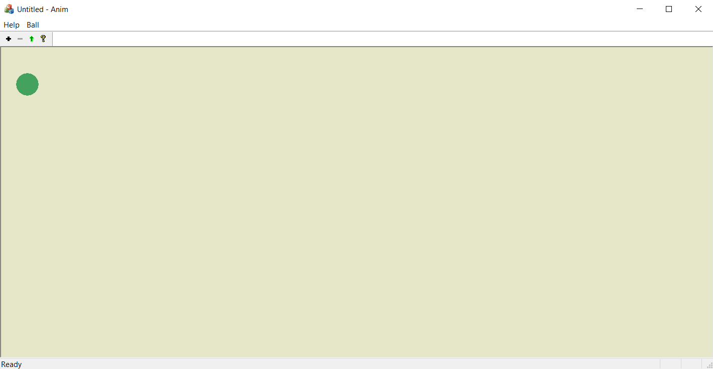
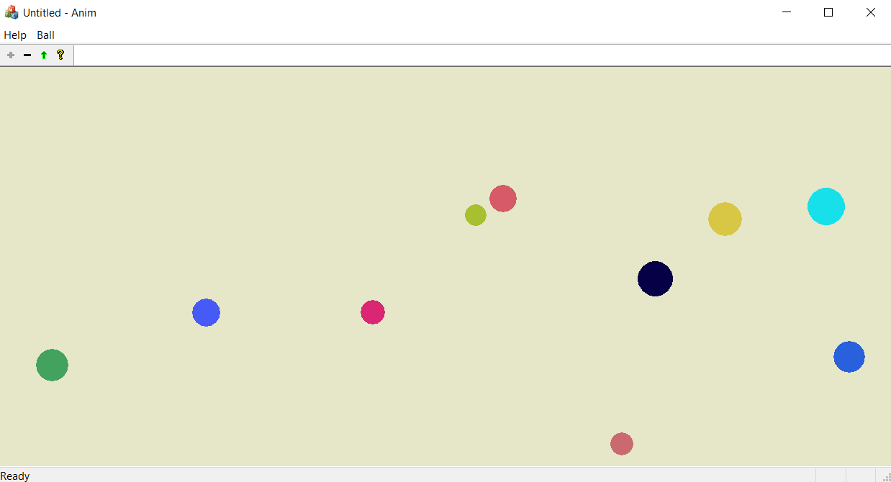
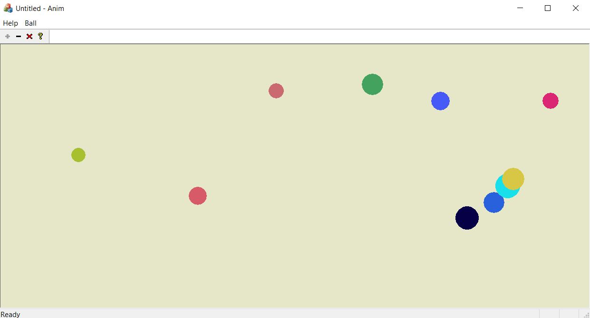
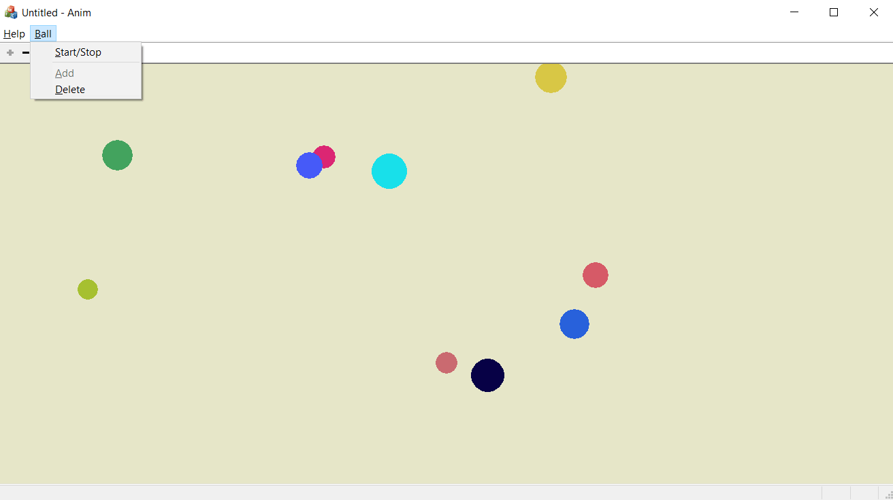

# MFC-animation
Project in C++/MFC for University - Windows programming - class
Written in VS 2019  
<b>!! Not tested anywhere else than VS 2019 !!</b>

# Description
This is a simple programme using MS MFC library that creates single document solution

 

At the beginning there is only one ball but up to ten 
can be added by simply pressing the plus button. 
Their position is pseudo-random ( use of simple srand() ).

 

When green arrow pressed, balls start to move in random directions, 
sometimes over each other and they bounce back from the walls.

 

<b>!!ATTENTION!!</b> 
When the size of a window is changed, balls ale pushed back into it so they won't "escape" while reshaping the area.

This programme also supports use of so called "HotKeys".
